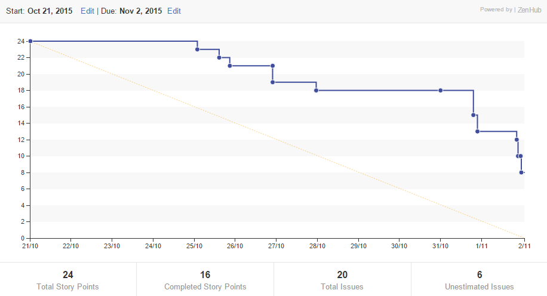

# Phase 2 Report

## Initial Planning - October 20th
### Scrum Master:
The scrum master is a member of the team who helps facilitate the work of other members, while keeping them on task. The scrum master is the individual who deals with problems that may get in the way of product development, allowing the rest of the team to focus on the tasks they have chosen.

### Task breakdown:

**Small** - Small tasks are those that will take 2 to 3 hours to complete at most. Things like the basic HTML layout and small front end components will fall under this category.

**Medium** - Medium tasks are tasks that are larger than small tasks, but can still be finished within the day. There are general ideas of how to approach the task, but a concrete solution needs to be created and implemented.

**Large** - Large tasks are tasks that will take longer than a day to complete. They are tasks whose details we have not yet fully worked out. Upon learning more, large tasks will *most likely* be broken down into smaller tasks, and their categories reassigned.

### Other discussions:
- Zenhub was suggested for its burndown chart and to help with issue tracking.

- MVP: The minimum viable product will just display a list of courses that has the minimal amount of conflict.

## Sprint Backlog
On October 20th, 2015 the team met on Slack to speak about the logistics of the project. We decided on building a timetable generator. The way it would work is that the user would enter up to six courses and our timetable generator will connect to an API with the course info, get the different sections available and get all permutations of the different timetables available and display them. The timetables will be sorted by the least time spent at school. We decided to make a web app using node.js. We also decided on using an API (Cobalt) which would allow us to retrieve uoft course information.

To do this, we decided that there will split the application into different sections: [frontend](https://github.com/csc301-fall-2015/project-team12-L0101/issues?utf8=%E2%9C%93&q=+label%3Afrontend+) and [backend](https://github.com/csc301-fall-2015/project-team12-L0101/issues?utf8=%E2%9C%93&q=+label%3Abackend+). We didn't decide on the order of tasks or the responsibilites. Instead, Wayne created issues which served as guidelines on what we needed to accomplish. We self-assigned these as we saw tasks that needed to be completed. We created sub-issues where we realized that a larger task could be split into smaller parts. To make this process easier, the TA suggested that we use Zenhub to be able to see which tasks are open and which ones have been completed. We had originally attempted to use Trello, but Zenhub was integrated into Github, and had similar functionality. It also included a burndown chart, and some other handy features.

## Update Meetings

### Meeting 1
**Scrum Master: Samir Patel**  
**Date: October 30, 2015**  
**Time: 9:00pm - 9:08am**  
**1-3 minutes:** We were told who did what work.  
**Samir:** [Worked on the frontend display](https://github.com/csc301-fall-2015/project-team12-L0101/issues/5). [Worked on Generate button](https://github.com/csc301-fall-2015/project-team12-L0101/issues/8). [Worked on Add Course button](https://github.com/csc301-fall-2015/project-team12-L0101/issues/7). [Worked on creating our own API with Wayne](https://github.com/csc301-fall-2015/project-team12-L0101/issues/18).  
**Wayne:** [Added Bootstrap](https://github.com/csc301-fall-2015/project-team12-L0101/issues/23). [Worked on creating our own API with Samir](https://github.com/csc301-fall-2015/project-team12-L0101/issues/18). [Worked on calling the U of API with Ellen](https://github.com/csc301-fall-2015/project-team12-L0101/issues/15).  
**Ellen:** [Worked on calling the U Of T API with Wayne](https://github.com/csc301-fall-2015/project-team12-L0101/issues/15)  
**Jacky:** [Updated the frontend display](https://github.com/csc301-fall-2015/project-team12-L0101/issues/5). [Updated initial structure](https://github.com/csc301-fall-2015/project-team12-L0101/issues/7). [Updated Generate Button design](https://github.com/csc301-fall-2015/project-team12-L0101/issues/8). [Added Functions to display a course in timetable and a sample course with Eugene](https://github.com/csc301-fall-2015/project-team12-L0101/commit/d8afe919844e795add345ba7c8adb98f146bb316).  
**Eugen:** [Added the Readme.md with the description of Scrum Master and small, medium, large tasks](https://github.com/csc301-fall-2015/project-team12-L0101/commit/0e07a33a562cc161ccd14c9d06091aabe5ca288b). [Added Functions to display a course in timetable and a sample course with Jacky](https://github.com/csc301-fall-2015/project-team12-L0101/commit/d8afe919844e795add345ba7c8adb98f146bb316).  
**3-8 minutes** We were told who was doing what work.  
**Samir:** [Going to work on adding the course list design](https://github.com/csc301-fall-2015/project-team12-L0101/issues/19)  
**Wayne:** [Going to work on permutations of possible course arrangements](https://github.com/csc301-fall-2015/project-team12-L0101/issues/16)  
**Ellen:** [Going to work on add course buttons functionality](https://github.com/csc301-fall-2015/project-team12-L0101/issues/10)  
**Jacky:** [Currently updating Application layout](https://github.com/csc301-fall-2015/project-team12-L0101/issues/6). [Going to work on view course arrow buttons](https://github.com/csc301-fall-2015/project-team12-L0101/issues/13)  
**Eugene:** [Going to work on the view course design](https://github.com/csc301-fall-2015/project-team12-L0101/issues/9)  
Everyone is going to try to have their work done by tomorrow (October 31, 2015)

### Meeting 2
**Scrum Master: Jacky Van**  
**Date: October 30, 2015**  
**Time: 5:00pm - 5:05am**  
**1-2 minutes:** We were told what work had been completed by whom.  
**Samir:** [Worked on and completed the View Course rendering function with Jacky](https://github.com/csc301-fall-2015/project-team12-L0101/issues/12). [Worked on and completed getting and sorting the timetables by times spent at school](https://github.com/csc301-fall-2015/project-team12-L0101/issues/44).  
**Wayne:** [Worked on and completed getting permutations of the timetables with Eugene](https://github.com/csc301-fall-2015/project-team12-L0101/issues/16).  
**Ellen:** [Worked and completed getting a dropdown list](https://github.com/csc301-fall-2015/project-team12-L0101/issues/19). [Worked on getting autocomplete functional as courses are entered](https://github.com/csc301-fall-2015/project-team12-L0101/issues/10).  
**Eugene:** [Worked on and completed getting permutations of the timetable with Wayne](https://github.com/csc301-fall-2015/project-team12-L0101/issues/12). [Worked on and completed getting and sorting the timetables by times spent at school](https://github.com/csc301-fall-2015/project-team12-L0101/issues/44).  
**Jacky:** [Worked on and completed the View Course rendering function with Samir](https://github.com/csc301-fall-2015/project-team12-L0101/issues/12).  
**3-5 minutes:** We were told who was completing the final few things which were left  
**Samir:** Going to work on the team and review retrospective.  
**Wayne:** Going to work on team burndown.  
**Ellen:** [Going to complete the dropdown list with the autocomplete functionality](https://github.com/csc301-fall-2015/project-team12-L0101/issues/10).  
**Jacky:** [Going to work on the View Course arrow buttons with Eugene](https://github.com/csc301-fall-2015/project-team12-L0101/issues/13). [Going to work on the Generate button functionality with Eugene](https://github.com/csc301-fall-2015/project-team12-L0101/issues/11). [Going to finalize and touch up the application layout](https://github.com/csc301-fall-2015/project-team12-L0101/issues/6).  
**Eugene:**  [Going to work on the View Course arrow buttons with Jacky](https://github.com/csc301-fall-2015/project-team12-L0101/issues/13). [Going to work on the Generate button functionality with Jacky](https://github.com/csc301-fall-2015/project-team12-L0101/issues/11).

## Burndown Chart
The Y-Axis in this burndown chart represents the total number of story points we have for our entire MVP. Our small tasks are worth 1 point, our medium tasks are worth 2, and our large tasks are worth 3.

## Individual Burndown Links
* [Wayne (Zsw007)](./burndown/Zsw007.png)
* [Eugene (eu-wong)](./burndown/eu-wong.jpg)
* [Samir (samirp91)](./burndown/samirp91.jpg)
* [Jacky (Jaacky)](./burndown/Jaacky.jpg)

## Review & Retrospective
1.  **How the plan evolved**
    1. Within our initial plan, there were a few issues which we didn't address and 
    implement. The first one was [displaying course on timetable using inputted data](https://github.com/csc301-fall-2015/project-team12-L0101/issues/41). 
    The reason we didn't implement this was because we realized that there 
    wouldn't really be a need for this as we will be getting all the courses from the
    U of T API so the courses would already be in a JSON format with all the required
    data. Something we didn't fully complete was the [sorting permutations](https://github.com/csc301-fall-2015/project-team12-L0101/issues/44)
    requirement because for this task, we only decided to be able to sort permutations 
    according to the time spent at school and decided that we would do sorting by other
    options later. The same goes for [our own API for generating courses](https://github.com/csc301-fall-2015/project-team12-L0101/issues/17) since
    there will be many different ways to generate the timetables according to the
    options and for [timetable conflict checking](https://github.com/csc301-fall-2015/project-team12-L0101/issues/49) since our main priority was to
    only be able to get the time spent at school over the week and the ability to sort
    it by that time.
    2. There were a few tasks we split into subtasks. The one which has been split (and
    will be split again in the next phase) is the [sorting](https://github.com/csc301-fall-2015/project-team12-L0101/issues/44) task since this has 
    many different ways that the permutations could be sorted. So far, we've decided 
    to sort it by [time](https://github.com/csc301-fall-2015/project-team12-L0101/issues/50) and by [least amount of conflict](#https://github.com/csc301-fall-2015/project-team12-L0101/issues/9). We also decided
    to sub-task the [view course](https://github.com/csc301-fall-2015/project-team12-L0101/issues/12) rendering into two subtasks, [view single course by JSON](https://github.com/csc301-fall-2015/project-team12-L0101/issues/35)
    and [view single course by user-inputted data](https://github.com/csc301-fall-2015/project-team12-L0101/issues/41). We decided to get rid of the
    second one since we realized that we wouldn't have a case where we would need to 
    render a course by user-inputted data since we will be getting all our courses from
    the U of T API. The reason we decided to subtask this was because it would be
    easier for us to display one single course and after that, we could go through a 
    list and input each one of the courses using the same method. The thought process 
    was a lot simpler.  

2. **Reflection**
    1. At the beginning of the initial process, we decided to use Trello to keep 
    track of issues and we ran this by the TA. She suggest that we use ZenHub so 
    we tried it and it worked pretty great. It was very easy for us to see which tasks
    were being worked on, which tasks were already assigned to someone and which tasks
    were not being worked on. This gave us a very clear visual and allowed us to set
    our priorities and work on what was suitable for us. Also for the initial meeting,
    we decided to make a new group in Slack which allowed us to refer back to what was
    said when creating the issues and writing up the sprint backlog.  
    2. One thing everybody agreed on which was weak was communication. We all expected
    the issues to be a concrete way to do work so that when someone finished an issue
    the commit message would be helpful enough so that the person using that code
    would understand what still needed to be done. But what ended up happening in 
    one case was that the code was not fully understood and users had to clarify with
    other users as to why a code was written in some specific way or if some specific
    feature had been implemented.  
    3. The way we're going to tackle the communication problem is by opening a new
    channel in Slack which is dedicated to recording updates in general. This will be
    useful as many of us don't like to write long commit messages and if someone was
    to forget the reason for a PR or commit, they could just recheck the channel for
    a detailed explanation.
