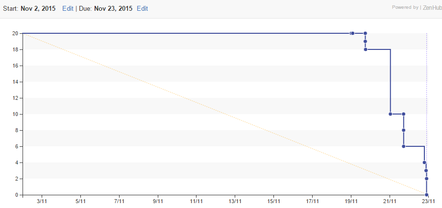

# Process

## Organization
The tools we used to organize ourselves for this phase of the assignment were Zenhub and Slack. Zenhub has allowed us to assign task size estimations for various issues that we have openned, and the Zenhub board has allowed us to easily view and organize the issues. We've also made use of the Burndown feature to keep track of our work. This tool was chosen on our TA's recommendation, and has proven to be very useful in our project organization.

Slack has allowed us to effectively communicate with each other. We've made some changes since the last phase, adding new channels with dedicated purposes. For example, we created a channel soley for project udpate information, since it was getting lost in our discussion channel in the previous phase. Slack was chosen over other communication platforms like Skype because it was much easier to create multiple channels with different purposes for the same group within one place. In Skype, multiple group chats would have to be created, and would not be grouped together.

## Meeting 1
**Date:** November 18 2015

**Time:** 3:00pm to 6:00pm

### Current problems:
* Dealing with year courses
* Sorting/filtering out overlapping courses (example: csc/engineering have different sections for the same course)
* Dropdown menu for second term courses still display all possible courses

### Possible solutions discussed 
We had difficulty deciding on what solution to use to split up the two terms. The main problem we faced was that
displaying a year course for both terms with our planned implementation would display varying meeting times for year courses 
since we were only looking at permutations for a single term without taking the second term into consideration.

A solution suggested was to put each term's selected courses into its own array. When we entered a year course we would put it into both with
a specific meeting section and generate permutations around it. Another suggestion was to use what we had already put in place, and
simply match them up when we sent the permutations of all the courses to be displayed on the front end.

What we decided to go with is to allow the user to pick courses for both terms (instead of originally only allowing one at a time), allowing us to
generate one set of course times. The worry here was that it would take too long to make a permutation of 12 courses, but since this was the quickest 
to implement and test, we decided to give it a try for now.

### Work done:
Group worked together to discuss ideas and fix/implement features:

**Eugene, Wayne, Samir** Permutations and course filtering for both terms

**Jacky, Ellen** Various front end changes such as displaying both terms, adding another column for another term's worth of courses

### TODO List:
* Input validation for courses
* Finishing up display of courses
* Filtering based on some time constraints (eg, cannot attend classes at specific times of day)
* Implementation of additional sorting options

## Artifacts:

### Team Burndown

### Individual Burndowns
* [Wayne (Zsw007)](./burndowns/Wayne.png)
* [Eugene (eu-wong)](./burndowns/Eugene.jpg)
* [Samir (samirp91)](./burndowns/Samir.jpg)
* [Jacky (Jaacky)](./burndowns/Jacky.jpg)
* [Ellen (ellenupp)](./burndowns/Ellen.png)
